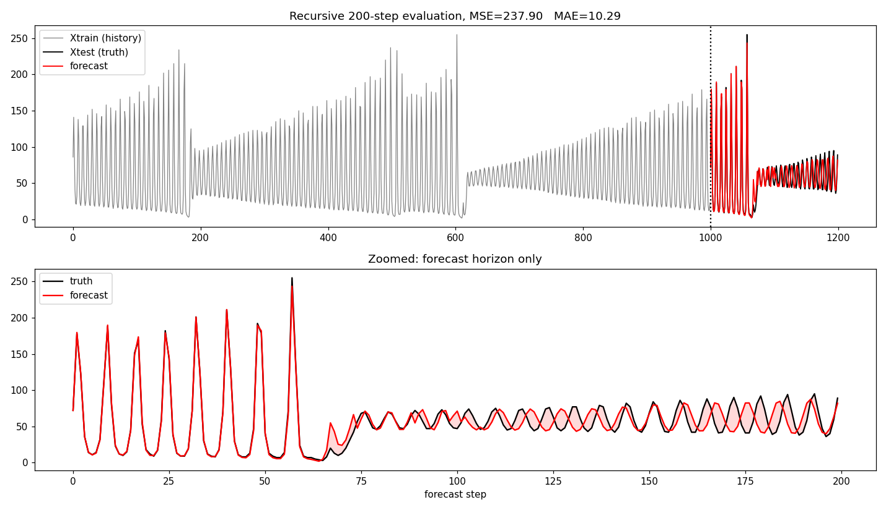

# Chaotic Time-Series Forecasting with a Residual RNN Ensemble

Deep Learning assignment on recursive forecasting of a chaotic scalar time series.
Given a single training signal (`Xtrain.mat`), the goal is to predict the next **200 steps** of the series and evaluate them against the held-out ground truth (`Xtest.mat`).

The signal is a chaotic laser-intensity series (values roughly in `[2, 255]`) characterised by
quasi-periodic oscillations of period ≈ 7–8 punctuated by sudden **amplitude collapses** followed by
gradual recovery. These rare collapse events are the hardest part of the signal to predict and are the
main thing the modelling choices here are built around.



## Approach

The forecast is produced by an **ensemble of residual recurrent networks** rolled out recursively
(each prediction is fed back as the next input). Several techniques are combined to keep the long
rollout stable and to capture the collapse dynamics:

- **Residual RNN** (`ResidualRNN`) — an input projection, a multi-layer GRU **or** LSTM with a skip
  connection, layer normalization, and a GELU output head. Optionally predicts a residual (delta)
  instead of the absolute next value.
- **Ensemble of 16 models** — alternating GRU and LSTM cells across 16 seeds; their per-step
  predictions are averaged (or median-aggregated) during the recursive rollout.
- **Stochastic Weight Averaging (SWA)** — weights from the late epochs are averaged, which generalises
  better over long recursive horizons than any single checkpoint.
- **Collapse-aware oversampling** — windows corresponding to collapse onset/troughs
  (`find_collapse_windows`) and post-collapse recovery (`find_posttail_windows`) are oversampled during
  training so the rare transitions are not drowned out.
- **Input noise, gradient clipping, and prediction clamping** for robustness in the chaotic regime.
- **Period regularization** — an autocorrelation-based penalty (lag 8) that discourages the model from
  drifting to the wrong oscillation period.
- **Phase warp** (`phase_warp`) — a post-processing step that measures the forecast's rolling period and
  stretches/compresses it back toward the initial period to correct accumulated phase drift.

Data is scaled to `[-1, 1]` with a `MinMaxScaler`, and training uses sliding windows of length
`lookback` (60 in the final run) with a Smooth L1 loss.

## Repository layout

| File | Purpose |
| --- | --- |
| `model.py` | Core library: scaler, windowing, collapse/recovery window detection, `ResidualRNN`, training loop (SWA + oversampling), recursive & ensemble forecasting, and phase warp. |
| `analyze.py` | Exploratory analysis of `Xtrain` — autocorrelation, dominant lag detection, and a phase plot. Saves `analysis.png`. |
| `tune.py` | Hyperparameter search over `lookback` values across two random train/validation splits; writes results to `tune.json`. |
| `final_train.py` | Trains the final 16-model ensemble on the full training series, saves weights + `config.json`, and produces the recursive forecast. |
| `predict.py` | Loads a saved ensemble and generates a fresh recursive 200-step forecast (with phase warp). |
| `evaluate_test.py` | Compares the saved forecast against `Xtest.mat` and reports MSE / MAE. Saves `test_eval.png`. |
| `Xtrain.mat` / `Xtest.mat` | Training series and the 200-step ground-truth continuation. |
| `final_run/` | Saved artifacts of the final ensemble: 16 model checkpoints, `config.json`, forecasts (`.npy`/`.csv`), and plots. |
| `final_val_run/` | Equivalent artifacts from a run that held out the last 200 steps for validation. |
| `tune.json` | Raw results of the hyperparameter search. |

## Usage

Requirements: `numpy`, `scipy`, `torch`, `matplotlib` (a CUDA GPU is used automatically if available,
otherwise it falls back to CPU).

```bash
# 1. (optional) inspect the signal
python analyze.py

# 2. (optional) run the lookback hyperparameter search
python tune.py

# 3. train the final ensemble and generate a forecast
python final_train.py

# 4. generate a forecast from an already-trained ensemble
python predict.py

# 5. evaluate the saved forecast against the test set
python evaluate_test.py
```

## Results

The final ensemble (`final_run/config.json`) reaches a **200-step recursive MSE ≈ 238** and **MAE ≈ 10.3**
against the held-out test set, on a signal spanning roughly `[2, 255]`.
